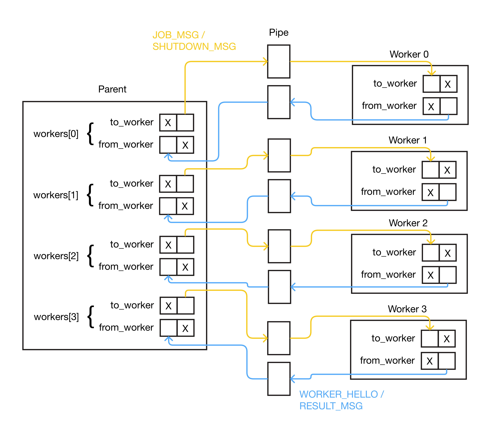

# Parallel Image Processing

A multi-process image filtering tool that distributes image processing jobs across a pool of worker processes using pipe-based communication.

## Overview

The program spawns 4 worker processes at startup. A parent process assigns image-processing jobs dynamically to available workers. Workers apply the requested filter and return results via a binary message protocol over pipes.

Supported filters: greyscale (`grey`), blur (`blur`), edge detection (`edge`)  
Input format: PPM P6 binary

## Architecture

<p align="center">
    
</p>

The system follows a worker pool pattern:
- Parent creates all workers upfront via `fork()`
- Each worker sends a `WORKER_HELLO` handshake before receiving any jobs
- Parent dispatches `JOB_MSG` to idle workers; workers respond with `RESULT_MSG`
- After all jobs complete, parent sends `SHUTDOWN_MSG` to each worker and reaps them with `waitpid()`

## Build & Usage

Build:
```bash
make
```

Run:
```bash
./program <input1.ppm> <output1.ppm> <filter> [<input2.ppm> <output2.ppm> <filter> ...]
```

Clean:
```bash
make clean
```

## Message Protocol

All messages are fixed-width binary structs sent over pipes.

| Message | Direction | Purpose |
|---|---|---|
| `WORKER_HELLO` | Worker → Parent | Worker ready after init |
| `JOB_MSG` | Parent → Worker | Assign an image processing job |
| `RESULT_MSG` | Worker → Parent | Report job outcome (success/fail) |
| `SHUTDOWN_MSG` | Parent → Worker | Graceful termination |
